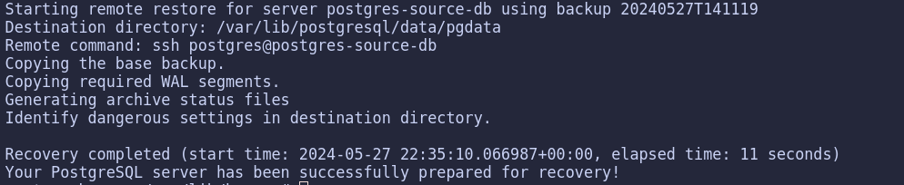

<center>

# Postgresql com PgBarman

Projeto dedicado a exemplificar o gerenciamento de backups com o PgBarman

</center>

> IMPORTANTE
> Todos os comandos a seguir devem ser executados na pasta raiz do projeto

---

<center>

## Rodar

</center>

Projeto precisa de algumas pastas e arquivos de chaves para comunicar as duas instâncias (banco de dados -> gerenciador de backup).
```bash
bash run.sh configure;
```

Buildar.
```bash
bash run.sh build;
```


Levantar os containers.
```bash
bash run.sh up;
```


Parar os containers.
```bash
bash run.sh stop;
```


Parar e remover os containers.
```bash
bash run.sh drop;
```


Parar, remover os containers e pastas e chaves criados (Remover por completo o projeto da maquina). Lembrando que estamos usando volumes do tipo bind para ficara mais fácil de visualizar os arquivos sendo criados.
```bash
bash run.sh drop_hard;
```

> IMPORTANTE
> Depois do `bash run.sh drop_hard` todos os dados registrados ou utilizados para testes serão perdidos


---

<center>

## Importar

</center>

Para popular o banco de dados.
```bash
bash run.sh populate;
```

---

<center>

## Manutenção

</center>

Para garantir a inicialização do barman.
```bash
docker exec pg-barman barman cron;
```

Para verificar se esta tudo `OK` com os servers gerenciados pelo Barman.
```bash
docker exec pg-barman barman check all;
```

Para realizar um backup de todos os servers gerenciados pelo Barman.
```bash
docker exec pg-barman barman backup all;
```

---

<center>

## Possiveis problemas

</center>

Após iniciar os containers pela primeira vez pode haver a necessidade de importar todos os WALs para o container do barman.
```bash
docker exec pg-barman barman switch-wal --force --archive all;
```

<center>

## Barman recover

</center>

Para recuperar um backup, necessário ficar atento ao nome do servidor.
```bash
docker exec pg-barman barman recover --remote-ssh-command "ssh postgres@postgres-source-db" postgres-source-db latest /var/lib/postgresql/data/pgdata;
```

Para listar backups disponíveis.
```bash
docker exec pg-barman barman list-backup postgres-source-db;
```

Para listar um backup específico.
```bash
docker exec pg-barman barman show-backup postgres-source-db latest;
```

---

<center>

### Simulação de falha

</center>

---

Para simular uma falha no servidor de banco de dados, basta parar o container.
```bash
docker exec -it --user=postgres postgres-source-db pg_ctl stop;
```

Certifique que no arquivo docker-compose.yml o tty: true esteja descomentado e o restart esteja com o valor default. Isso é necessário para que o container não seja removido após parar o serviço do postgres.
```yml
tty: true
```

No servidor do postgres, execute o container em modo interativo.
```bash
docker exec -it postgres-soucre-db bash;
```
Vamos criar uma pasta temporária com o PGDATA atual do postgres e remover o PGDATA.
```bash
cd /var/lib/postgresql/data/;
cp -a pgdata/ old_pgdata;
rm -rf pgdata;
```

Agora rode o comando recover do barman, com o path do PGDATA antigo.
```bash
docker exec pg-barman barman recover --remote-ssh-command "ssh postgres@postgres-source-db" postgres-source-db backup-id /var/lib/postgresql/data/pgdata;
```

Output do barman com sucesso deverá ser similar ao da imagem:



No servidor do postgres, execute o comando para iniciar o postgres novamente passando o parametro -D que significa datadir.
```bash
docker exec --user=postgres postgres-source-db postgres -D /var/lib/postgresql/data/pgdata -c wal_level=hot_standby -c port=5432 -c hba_file=/var/lib/postgresql/config/pg_hba.conf -c archive_mode=on -c archive_command="rsync -a %p barman@pg-barman:/backup/barman/postgres-source-db/incoming/%f" -c max_wal_senders=2 -c max_replication_slots=2;
```